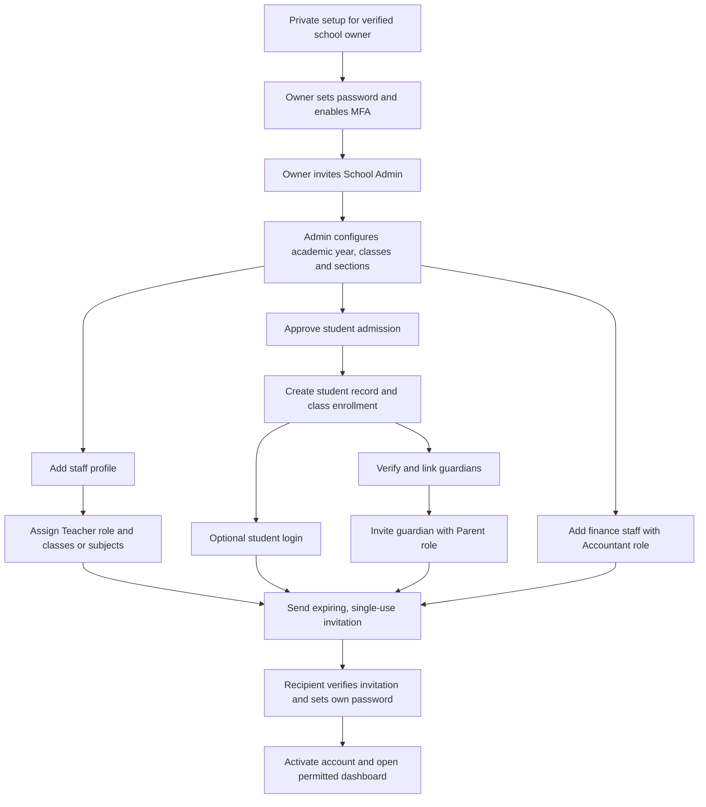
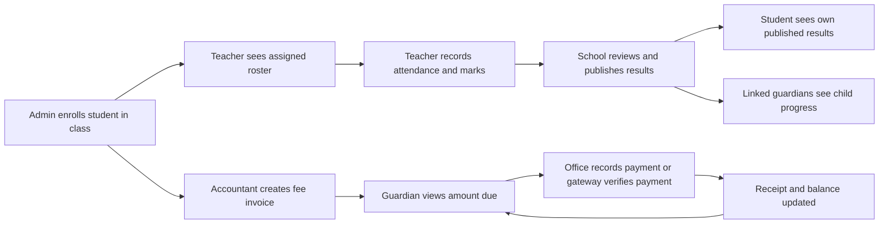

# Proposed account and school workflow

Researched 2026-09-08. Proposal only; these features are not implemented.
Assumption: first release serves one school.

## Design inspiration

- Moodle assigns roles within contexts, such as courses: https://docs.moodle.org/502/en/Assign_roles
- Moodle links parent access to individual students: https://docs.moodle.org/502/en/Parent_role
- Frappe separates student records from optional login accounts: https://docs.frappe.io/education/student
- Frappe supports multiple guardians and invites guardians after creating their records: https://docs.frappe.io/education/guardian

## Our proposed rules

An account identifies the person signing in. Roles determine permitted actions.
Relationships determine which records those actions apply to. Server-side checks
must enforce all three, including exports and direct URLs.

One person can have multiple roles. A teacher who is also a parent uses one login,
with separate Teacher and Parent dashboard views. Switching views never grants access.

| Role | Who assigns it | Scope |
| --- | --- | --- |
| Owner / Super Admin | Private one-time setup for the verified school owner | School settings, administrators, all authorized school operations |
| School Admin | Owner | Admissions, staff, class setup, operational role assignments |
| Teacher | Owner or School Admin | Assigned classes and subjects only |
| Student | Owner or School Admin through approved admission | Own timetable, attendance, assignments and published results |
| Parent / Guardian | Owner or School Admin after verifying relationship | Explicitly linked children only |
| Accountant | Owner or School Admin | Fees, payments, receipts and financial reports |

Ordinary admins cannot grant Owner or Admin privileges. No public role-selection
registration. Future public admissions create pending applications, not privileged accounts.

## Account creation

The first owner is provisioned through a private server command, never by making
the first public registrant an admin. Provisioning does not overwrite an existing
owner. Use an expiring setup link and close first-owner setup after completion.
Do not send shared/default passwords. Invitations require a configured email
provider; office-assisted activation is a separate controlled process if needed.

An existing verified account receives a role/link update rather than a duplicate
login. The admin confirms identity before connecting records.

Student records do not require student email or portal access. A young child may
have only a school record and a guardian portal. A guardian can have several
children; a child can have several approved guardians. Emergency-contact status
alone does not grant portal access. Relationship restrictions are handled by staff.

## Daily operation

Parents cannot mark their own invoices paid. Online payments require a verified
provider event; repeated events must not create duplicate payments. Grades stay
private while drafts. Teachers can correct attendance within a configured window;
later changes require admin review and an audit record.

## Account lifecycle and records

- Pending invitation -> Active -> Suspended or Archived.
- Expired/revoked invitations cannot activate accounts; resend invalidates old links.
- Record role assignments, guardian links, grade publication and financial changes
  with actor, timestamp and reason where applicable.
- Suspension blocks login and revokes sessions. Remove staff assignments promptly
  on departure; retain historical attendance, grades and financial records.
- At year end, create new enrollments for the new academic year; do not overwrite
  old class membership and results.
- Preserve at least one active Owner. Require reauthentication for sensitive role changes.

## Example

Admin enrolls Ali in Grade 5 A, assigns Ms Sara to that class, and verifies Nadia
as Ali's guardian. Sara can mark Ali's attendance because of her class assignment.
Nadia can see Ali's published records because of the guardian link. Neither gains
access to every student simply by having a Teacher or Parent role.

## Suggested implementation sequence

1. Private owner setup, login, account status, invitations, roles and authorization tests.
2. Academic years, classes/sections, staff profiles and teacher assignments.
3. Student admissions, enrollment, guardian verification/linking and portal invitations.
4. Attendance and scoped dashboards.
5. Invoices, recorded payments, receipts and audit trail.
6. Exams, publication workflow, report cards and notifications.

Before implementation confirm school name, administrator email, one-school scope,
whether students need logins, and the email provider for invitations.
